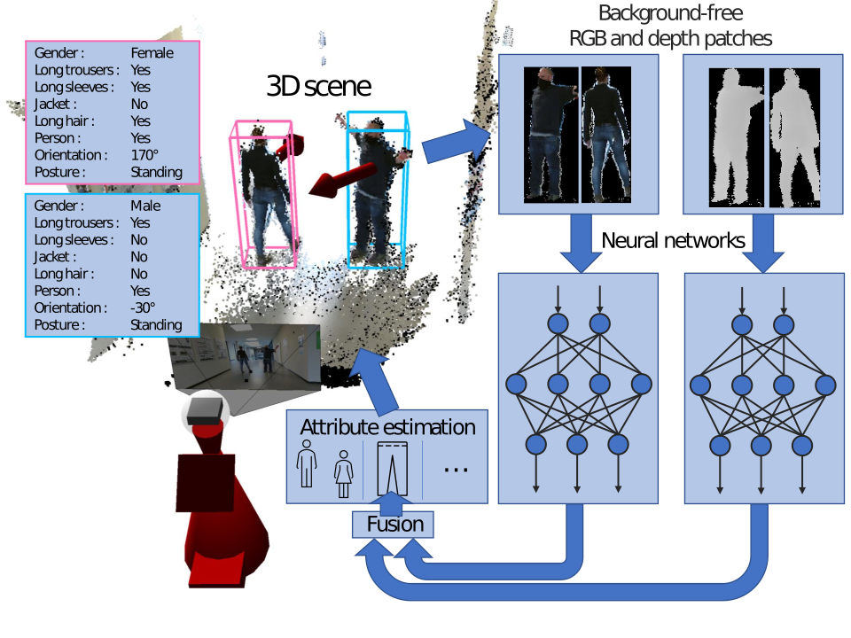

# RGBD Person Perception
This repository contains the code to our paper "Enhancing Person Perception for Mobile Robotics by Real-Time RGB-D Person Attribute Estimation".

Our efficient patch-based RGB-D person perception network simultaneously performs the tasks of person detection, soft-biometric attribute, posture and upper-body orientation estimation.

<div align="center">
  
</div>

## Video
<div align="center">
      <a href="https://youtu.be/Exda_QgXYoE"></a>
      <br>(Click on the image to open YouTube video)
      <br><br>
</div>

## License
The source code is published under Apache 2.0 license, see [license file](./LICENSE) for details.

## Installation
1. Clone repository:

    ```bash
    https://github.com/TUI-NICR/rgbd-person-perception

    cd /path/to/this/repository
    ```
2. Set up anaconda environment including all dependencies:

    ```bash
    # option 1: create conda environment from provided YAML file
    conda env create -f rgbd_person_perception.yaml
    conda activate rgbd_person_perception
    ```

    ```bash
    # option 2: create new conda environment manually
    conda create -n rgbd_person_perception python==3.7
    conda activate rgbd_person_perception
    conda install matplotlib
    conda install -c conda-forge cudnn==8.2.1.32
    pip install onnx==1.11.0
    pip install opencv-python==4.2.0.34
    pip install onnxruntime-gpu==1.11.0
    pip install torch
    pip install protobuf==3.20.*
    ```

## Apply already trained ONNX model
1. [Download](https://drive.google.com/u/0/uc?id=1c6mhbig4ZamppVXhu8ZFdcBBhnMhlMGM) and extract pretrained models to `./trained_models`.
2. [Download](https://drive.google.com/u/0/uc?id=1pBWO5Vl4iUVwxS6QbOE36d1vysAYHWcF) and extract example patches to `./samples`.
3. For inference on GPU run:

    ```bash
    python src/sample_inference_onnx.py ./trained_models/rgbd_resnet18.onnx ./samples/p0
    ```

4. Watch the result:

    ```text
    Load data from /path/to/this/repository/samples/p0
    Found 174 depth patches in folder
    Found 174 corresponding rgb patches in folder

    Load ONNX model /path/to/this/repository/trained_models/rgbd_resnet18.onnx

    Inference took 0.23 seconds with ONNX provider CUDAExecutionProvider
    This is 602.57 patches per second
    ```

    

    Please note that this script supports CUDA and CPU only via ONNXRuntime (inference times in the publication were determined with TensorRT on an NVIDIA Jetson AGX Xavier).

For further details and parameters, see:

```text
usage: sample_inference_onnx.py [-h] [-c] [-p] onnx_filepath image_folderpath

Apply RGB-D neural network for attribute estimation

positional arguments:
  onnx_filepath     Path to onnx model file
  image_folderpath  Path to a folder containing RGB and depth images with _rgb.png and _depth.png suffix and corresponding filenames

optional arguments:
  -h, --help        show this help message and exit
  -c, --cpu         CPU only, do not run with GPU support
  -p, --profile     Enable profiling
```
To apply another model, just change the *onnx_filepath* to another model in `./trained_models` (currently provided: rgbd_resnet18.onnx, rgbd_resnet34.onnx, mobilenet_v2.onnx).

To apply to other patches, just change the *image_folderpath* to another subpath in `./samples` containing a sequence of depth and RGB patches.

## Train a Network
coming soon

## Application in ROS
coming soon
